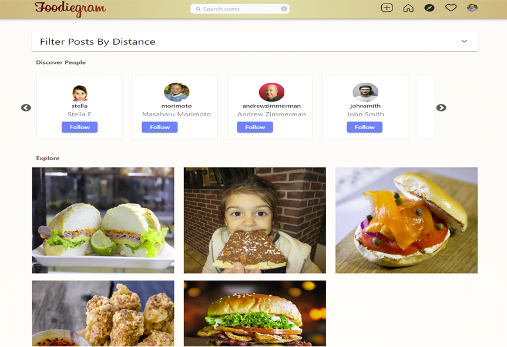

<!-- PROJECT LOGO -->
 

  <h3 align="center">Food Sharing Application</h3>

  
 
    <a href="">View Demo</a>
    ·
    <a href="https://github.com/feliceforgione/foodiegram/issues">Report Bug</a>
    ·
    <a href="https://github.com/feliceforgione/foodiegram/issues">Request Feature</a>
  

<!-- ABOUT THE PROJECT -->

## About The Project

Share what you are eating with others and find new delcious foods to try.

 

### Built With

- [React 18](https://reactjs.org/)
- [Firebase](https://firebase.google.com/)
- [Material UI](https://mui.com/)
- [Apollo](https://www.apollographql.com/)
- [GraphQL](https://graphql.org/)
- [Hasura](https://hasura.io/)
- [PostgreSQL](https://www.postgresql.org/)
- [Cloudinary](https://cloudinary.com/)
- [PostGIS](https://postgis.net/)
- [Google Maps](https://developers.google.com/maps)

 

<!-- ROADMAP -->

## Roadmap

- [ ] Implement post sharing feature
- [ ] Multi-language Support

 

See the [open issues](https://github.com/feliceforgione/foodiegram/issues) for a full list of proposed features (and known issues).

 

<!-- CONTRIBUTING -->

## Contributing

Contributions are what make the open source community such an amazing place to learn, inspire, and create. Any contributions you make are **greatly appreciated**.

If you have a suggestion that would make this better, please fork the repo and create a pull request. You can also simply open an issue with the tag "enhancement".
Don't forget to give the project a star! Thanks again!

1. Fork the Project
2. Create your Feature Branch (`git checkout -b feature/AmazingFeature`)
3. Commit your Changes (`git commit -m 'Add some AmazingFeature'`)
4. Push to the Branch (`git push origin feature/AmazingFeature`)
5. Open a Pull Request

 
<!-- CONTACT -->

## Contact

Felice Forgione - [@forgione67](https://twitter.com/forgione67)

Project Link: [https://github.com/feliceforgione/iEats](https://github.com/feliceforgione/foodiegram)
