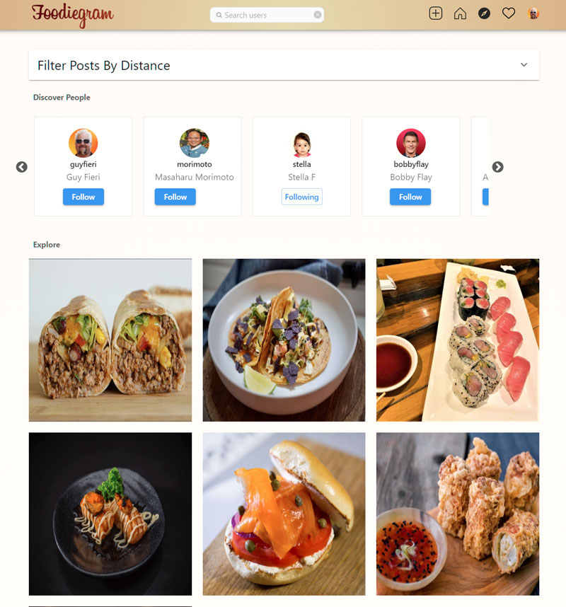

<!-- PROJECT LOGO -->
 

  <h3 align="center">Food Sharing Application</h3>

  
 
    <a href="">View Demo</a>
    ·
    <a href="https://github.com/feliceforgione/foodiegram/issues">Report Bug</a>
    ·
    <a href="https://github.com/feliceforgione/foodiegram/issues">Request Feature</a>
  

<!-- ABOUT THE PROJECT -->

## About The Project

### Share what you are eating with others and find new delcious foods to try.

### Find interesting foods in your area.

 

## Built With

|                                                   |                                            |                                                 |
| ------------------------------------------------- | :----------------------------------------: | ----------------------------------------------: |
| [React 18](https://reactjs.org/)                  | [React Router 6](https://reactrouter.com/) |       [PostgreSQL](https://www.postgresql.org/) |
| [Firebase 8](https://firebase.google.com/)        |      [Material UI](https://mui.com/)       |           [Cloudinary](https://cloudinary.com/) |
| [Apollo](https://www.apollographql.com/)          |      [GraphQL](https://graphql.org/)       |                    [Hasura](https://hasura.io/) |
| [Google Maps](https://developers.google.com/maps) |      [PostGIS](https://postgis.net/)       | [React Hook Form](https://react-hook-form.com/) |

<!-- ROADMAP -->
 

# Features

- Explore new food posts that are within your current location
- Follow people who share foods that you enjoy
- Save your favorite posts
- Leave comments on posts
- Notifications of when people follow you or like your posts
- Find food posts from specific food establishments
- Suggestions for people to follow based on your likes
- Infitinte Scroll food feed

<!-- ROADMAP -->
 

## Roadmap

- [x] Implement post sharing feature
- [ ] Multi-language Support
- [ ] Login using Facebook or Twitter account

 

See the [open issues](https://github.com/feliceforgione/foodiegram/issues) for a full list of proposed features (and known issues).

 

<!-- CONTRIBUTING -->

## Contributing

Contributions are what make the open source community such an amazing place to learn, inspire, and create. Any contributions you make are **greatly appreciated**.

If you have a suggestion that would make this better, please fork the repo and create a pull request. You can also simply open an issue with the tag "enhancement".
Don't forget to give the project a star! Thanks again!

1. Fork the Project
2. Create your Feature Branch (`git checkout -b feature/AmazingFeature`)
3. Commit your Changes (`git commit -m 'Add some AmazingFeature'`)
4. Push to the Branch (`git push origin feature/AmazingFeature`)
5. Open a Pull Request

 
<!-- CONTACT -->

## Contact

Felice Forgione - [@forgione67](https://twitter.com/forgione67)

Project Link: [https://github.com/feliceforgione/iEats](https://github.com/feliceforgione/foodiegram)
